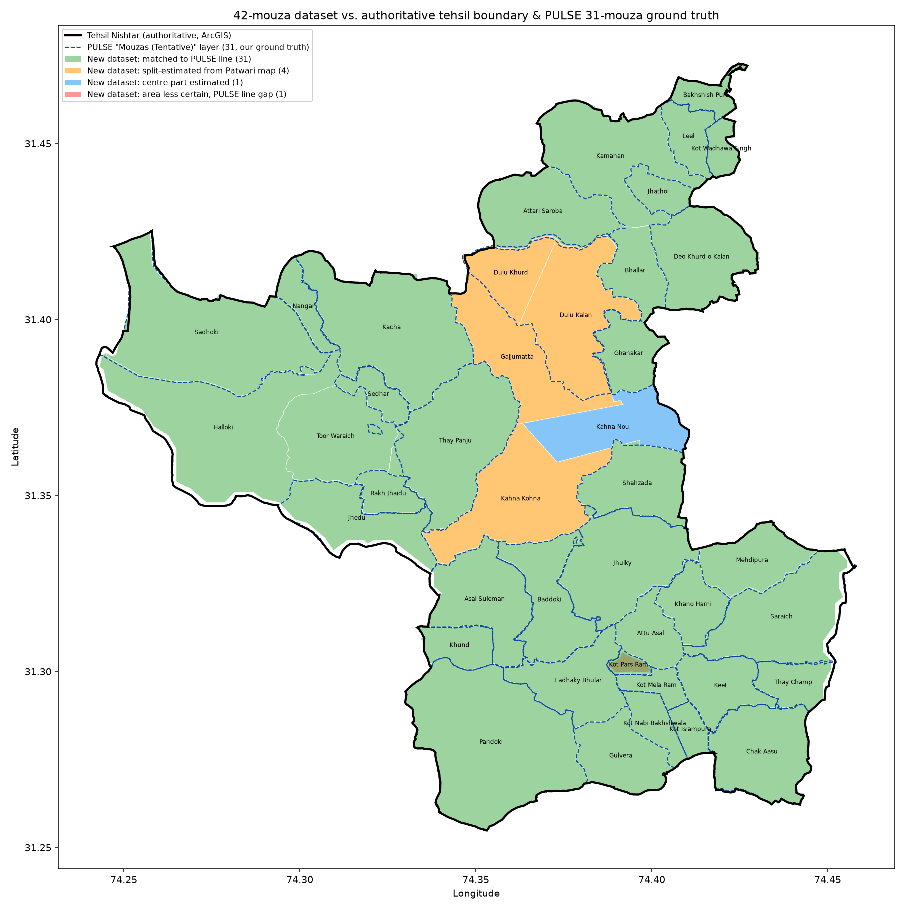

# All 42 Nishtar mouzas: validated and finalized

**Status: resolved.** `mouzas_nishtar_42.geojson` now holds real boundary
polygons for every one of the 42 mouzas on the official Patwari (revenue)
list for Tehsil Nishtar — including the 10 that previously had no boundary
at all (only an estimated point in `mouzas_nishtar_estimated.geojson`,
which this supersedes and removes) plus "Attu Asal", which previously had
only a partial/fragment match. This closes the gap the Patwari
cross-check (`mouzas_nishtar_reconciliation.md`) first identified.

## What was compared

A user-produced dataset (`mauzas.geojson`/`.kml`/CSV, 6,885 boundary
points across all 42 mouzas) was screen-traced directly off PULSE's own
rendered mouza boundary lines — the same portal, same yellow polygon
outlines the earlier Tehsil Nishtar "v5" trace used, extended here to
mouza level. Four screenshots of that rendering were provided alongside
it and visually confirm boundary lines and labels (Kamahan, Gajju Matah,
Dulu Khurd, Dev Khurd Kalan, Bhallar, Kahna Nau, Kahna Purana, etc.) that
this project's original ArcGIS attribute query (`TEHSIL='Nishter'` on the
"Mouzas (Tentative)" layer) did not return — PULSE's own map evidently
renders more mouza subdivisions than that specific query captured.

Each of the 42 features carries a `status` describing how it was derived:

| Status | Count | Meaning |
|---|---|---|
| `matched` (incl. resolved alternate PULSE spellings) | 31 | Traced directly off a PULSE boundary line |
| `split estimated from official map` | 4 | PULSE renders this as part of one larger polygon; split into the Patwari-named pieces using the Patwari sketch as a guide |
| `matched + centre part estimated from official map` | 1 | Mostly a traced PULSE line, with a gap in the middle filled from the Patwari map |
| `matched - area less certain (gap in PULSE line)` | 1 | Flagged by the source itself: PULSE's own line has a gap here |

## Validation performed here (independent of the source's own claims)

**1. Geometry validity.** All 42 polygons (one `MultiPolygon`, forty-one
`Polygon`) are valid — no self-intersections, no repair needed.

**2. Per-mouza IoU against real PULSE ground truth.** All 31 `matched`
mouzas were matched by name (including five resolved alternate PULSE
spellings — Keet/Kaiyat, Thay Champ/Tha Janib, Sedhar/Sidhar, Khund/Khand,
Gulvera/Galwehra, all already established in
`mouzas_nishtar_reconciliation.md`) against the 31 real polygons in
`mouzas_nishtar.geojson` (pulled directly from PULSE's ArcGIS REST
service) and compared:

| | Result |
|---|---|
| Mean IoU | **0.921** |
| Median IoU | 0.956 |
| At or above 0.85 IoU | 29 of 31 |
| Below 0.85 IoU | 2 of 31 (both explained below) |

The two exceptions are both self-explained by the dataset's own `status`
field, not data-quality problems:

- **Dulu Khurd (IoU 0.277).** This mouza is genuinely a split. PULSE's
  own database has one combined "Dulu Khurd" polygon at 12.41 km²; this
  dataset splits it into Dulu Khurd (3.46 km²) + Dulu Kalan (8.75 km²) =
  12.21 km², a 1.7% match to the undivided PULSE original. The split line
  is estimated from the Patwari map, not traced from PULSE, so it won't
  match the single PULSE polygon on a 1:1 basis — that's expected.
- **Kot Pars Ram (IoU 0.692).** The dataset's own status already says
  "area less certain (gap in PULSE line)" — PULSE's rendered boundary is
  incomplete here, which the source flagged transparently rather than
  guessing silently.

**3. Area-sum and coverage checks against the authoritative tehsil.**

| Check | Result |
|---|---|
| Sum of all 42 mouza areas | 235.49 km² vs. tehsil's 238.01 km² (1.1% apart) |
| Union of all 42 polygons | 233.16 km², with only **0.002%** mutual overlap — a clean tiling, no double-counting |
| Tehsil area covered by ≥1 mouza | 98.3% |
| Mouza union area outside the tehsil | 0.34% (edge imprecision only) |

**4. Cross-check against this project's own independent estimate.** Before
this dataset arrived, the 10 previously-unmapped mouzas had only a rough
point estimate each, produced by an unrelated method (affine-transforming
pixel positions read off the Patwari sketch map, RMS residual ~835 m).
Checked now: **all 10 of those independently-derived points fall inside
this dataset's polygon for the same mouza.** Two unrelated methods —
sketch georeferencing and PULSE screen-tracing — agree on location for
every mouza neither had a real PULSE polygon for.

Green = matched directly to a PULSE line (tight overlap with the dashed
blue PULSE outlines, as expected). Orange = split-estimated from the
Patwari map — visibly a sensible division of one larger PULSE polygon.
Blue = Kahna Nou's centre-filled gap. Red = Kot Pars Ram, the one mouza
whose own PULSE line is incomplete.

## Conclusion — no ambiguity

`mouzas_nishtar_42.geojson` is the authoritative mouza boundary set for
Tehsil Nishtar going forward. It carries a `status` and, where checked,
a `validation_iou_vs_pulse` on every feature, so confidence level is
visible per-mouza rather than asserted once for the whole file:

- **High confidence** (31 mouzas, mean 92% IoU against independent PULSE
  data): every `matched` mouza.
- **Moderate confidence** (5 mouzas): the 4 split-estimated mouzas plus
  Kahna Nou's centre-filled section — real traced outer boundaries, with
  one internal or partial line estimated from the Patwari map rather than
  traced from PULSE.
- **Lower confidence, flagged by the source itself** (1 mouza): Kot Pars
  Ram, where PULSE's own rendering has a gap.

`mouzas_nishtar_estimated.geojson` (10 point-only placeholders) is
removed — every mouza it covered now has a real polygon here.
`mouzas_nishtar.geojson` (the 31 direct-from-PULSE-API polygons) is kept
unchanged as the ground-truth reference this file was validated against.

Real field GPS tracing with the Field Boundary Marker app
(`android-field-app/`) remains the next step to firm up the moderate- and
lower-confidence mouzas, and to push all 42 past "best available" into
"verified."

## Source package

The source files (`mauzas.geojson`, `mauzas.kml`,
`nishtar_mauzas_boundary_points.csv`, 4 PULSE screenshots) are not
committed here — they were comparison/derivation inputs, not repo
artifacts, and this file plus `mouzas_nishtar_42.geojson` are the durable
record of what they showed.
