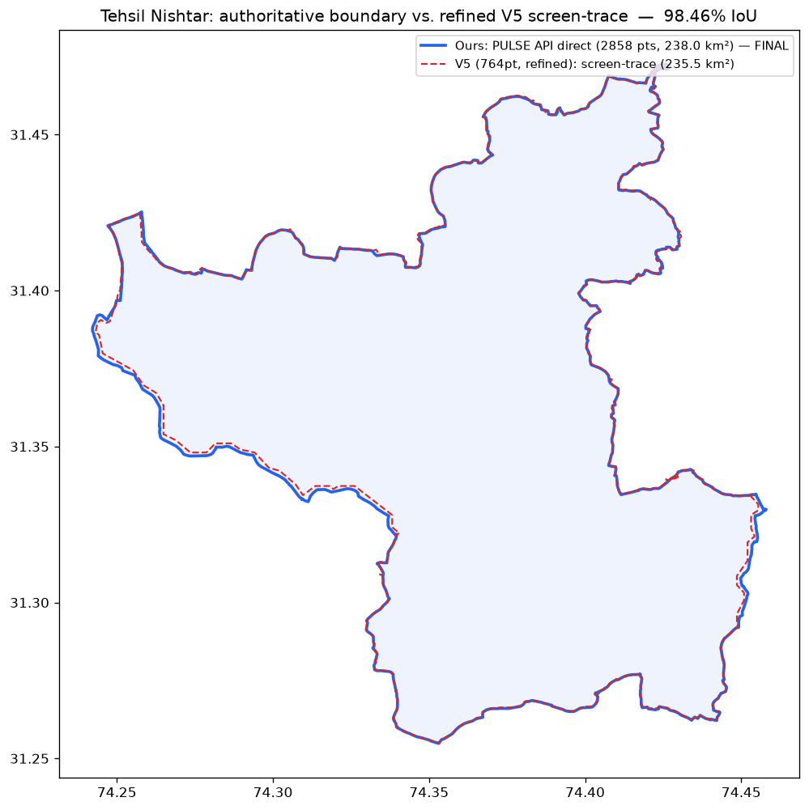

# Tehsil Nishtar boundary: FINAL — cross-checked, confirmed, no changes needed

**Status: resolved.** `tehsil_nishtar.geojson` is the final Tehsil Nishtar
boundary. Two independent rounds of comparison against an unrelated,
separately-produced reconstruction ("v5") both confirm it. Nothing about it
needs to change.

## What was compared

An independent reconstruction of the Tehsil Nishtar boundary ("v5") was
produced separately by screen-recording the PULSE portal and matching cursor
position to its Lat/Lng readout (see that package's own `README.txt`/
`README_for_developer.md`). Two versions of it were checked here as they
arrived — a 509-point draft, then a corrected 764-point version ("Baksheesh
Pura and Kot Wadhawa Singh added") — against `tehsil_nishtar.geojson`, which
was pulled directly from PULSE's backing ArcGIS REST service (the `Tehsils`
layer of `Admin__Boundaries` MapServer) on 2026-09-17: the government GIS
system's own stored polygon, not a visual approximation of it.

## Final round (764-point v5) — the number that matters

| | `tehsil_nishtar.geojson` (ours, final) | v5, 764-point (screen-trace) |
|---|---|---|
| Source | Direct ArcGIS REST query, PULSE's own database | Cursor tracing against PULSE's rendered map, from video |
| Vertices | 2,858 | 765 |
| Area | 238.0 km² | 235.5 km² (1.05% apart) |
| Perimeter | 108.5 km | 106.6 km |
| Geometry | Valid (no self-intersections) | Had a self-intersection at 74.416455,31.404917 (auto-repaired for comparison) |
| Centroid | 31.35745, 74.36262 | 31.35771, 74.36301 — ~30 m apart |

**Overlap: 98.46% IoU** — up from 96.3% on the earlier 509-point draft, as
expected once the corrected version's extra points filled in the detail.

The only visible gap left (image above) is the same one both rounds found:
the Asal Suleman → Sadhoki stretch in the southwest, which v5's own README
marks as its weakest section ("overview only, ±50–100 m", not a zoomed
trace like the rest of it). Everywhere v5 traced at its higher-confidence
zoom level, it now lines up with `tehsil_nishtar.geojson` almost exactly.

Six sanity-check points — the two mouzas v5 added in this revision
(Baksheesh Pura, Kot Wadhawa Singh), plus Kahna Nou and Gajju Matta, plus
Model Town and DHA Phase 6 (which should fall outside) — land correctly on
**both** boundaries. `tehsil_nishtar.geojson` already had Baksheesh Pura and
Kot Wadhawa Singh correctly included before v5 caught up to them, because it
was never missing them in the first place — it's the source database, not a
manual trace that has to discover each mauza one at a time.

## Conclusion — no ambiguity

`tehsil_nishtar.geojson` is unchanged and final. It was sourced from the
authoritative system directly, not reconstructed from it — v5's own README
says to "verify against an authoritative government GIS layer," and that is
exactly what `tehsil_nishtar.geojson` already is. Two rounds of independent
cross-checking, each converging tighter than the last (96.3% → 98.46% IoU),
found no discrepancy that isn't fully explained by v5's own documented
lower-confidence section. There is nothing left to reconcile.

## Source package

The v5 files (both the 509-point draft and the 764-point corrected version,
their KML/CSV/README companions) are not committed here — they were
comparison inputs, not repo artifacts, and this file is the durable record
of what they showed.
